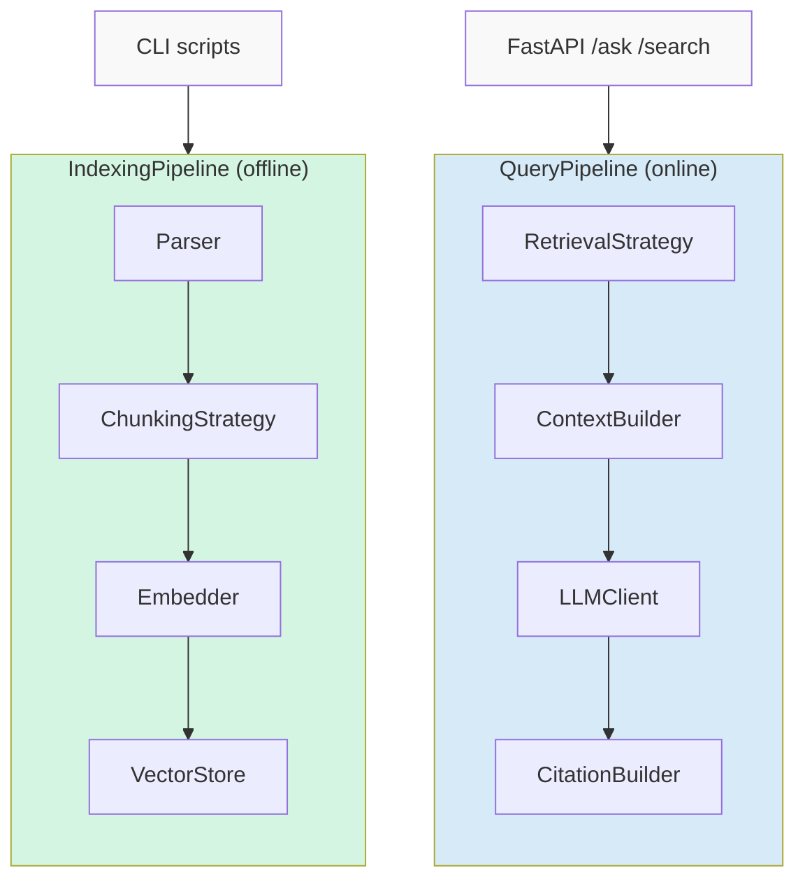
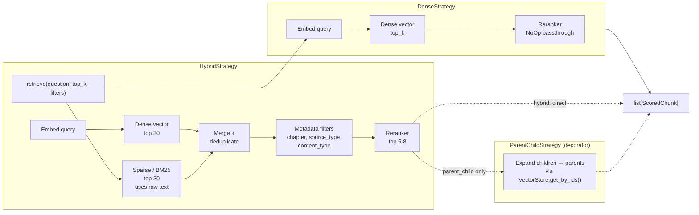
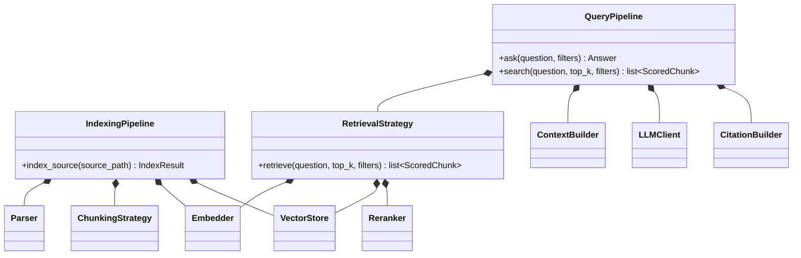
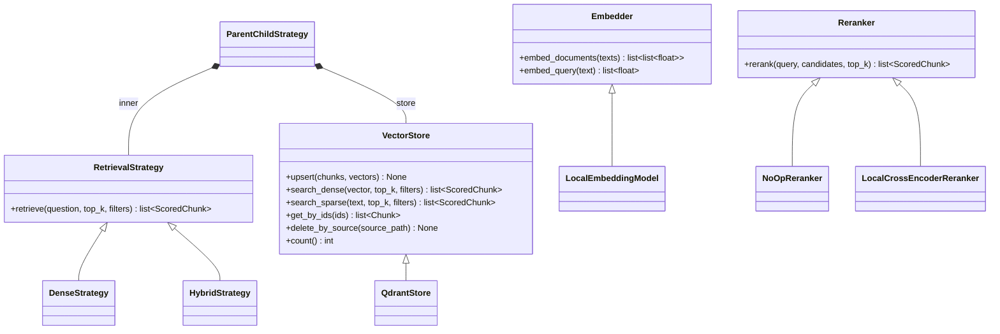
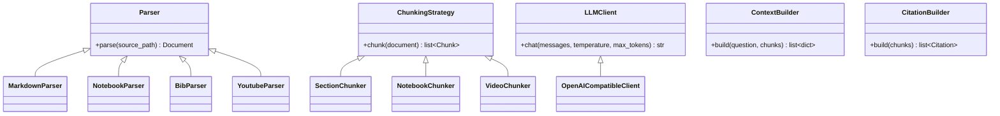
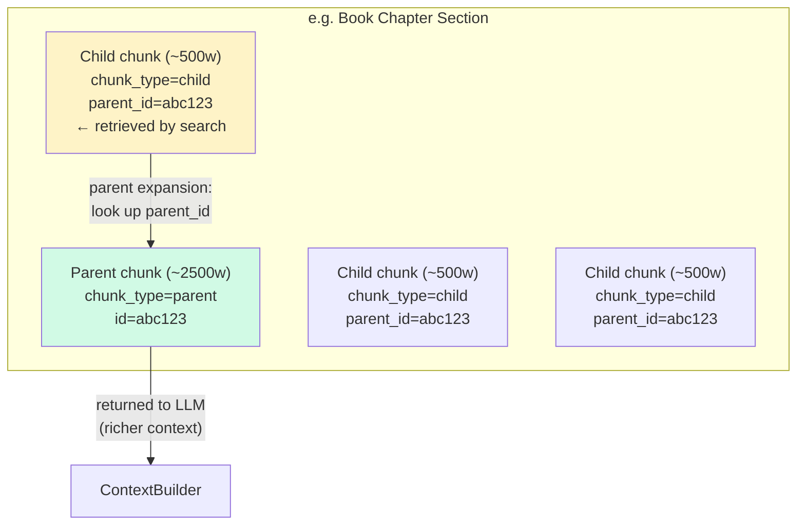

# Architecture Contracts — Developer Reference

Detailed component interfaces, adapters, and data models. For the high-level overview, see [architecture_overview.md](architecture_overview.md).

---

## Pipeline Modules

| Module | When | Triggered by | Interface |
|---|---|---|---|
| **IndexingPipeline** | Offline (CPU default, GPU optional) | `scripts/index_book.py` | `index_source(source_path) → IndexResult` |
| **QueryPipeline** | Online (per-request) | FastAPI `/ask`, `/search` | `ask(question, filters) → Answer` / `search(question, top_k, filters) → list[ScoredChunk]` |

Shared adapters (Embedder, VectorStore) injected into both.



---

## Retrieval Flow



`RETRIEVAL_STRATEGY` env var controls which strategy is instantiated:
- `dense` (default): `DenseStrategy(embedder, store, reranker)` — embed query → dense vector search → rerank
- `hybrid`: `HybridStrategy(embedder, store, reranker)` — dense + sparse/BM25, merged via Reciprocal Rank Fusion
- `parent_child`: `ParentChildStrategy(inner=<strategy>, store=store)` — expands child results to parents for richer LLM context

`/search` calls `QueryPipeline.search()` which delegates to `RetrievalStrategy.retrieve()`. `/ask` calls `QueryPipeline.ask()` which pipes retrieval results through ContextBuilder → LLMClient → CitationBuilder.

---

## Component Contracts

### Pipeline Modules



### Leaf Adapters — Storage & Retrieval



`ParentChildStrategy` is a decorator — wraps any `RetrievalStrategy` and uses `VectorStore.get_by_ids()` to expand child results to parents.

`VectorStore.upsert(chunks, vectors)` takes paired chunks and their embedding vectors. The `IndexingPipeline` calls `Embedder.embed_documents()` first, then passes both to `upsert()`.

### Leaf Adapters — Ingestion & Generation



---

## Core Data Types

### Chunk

```
Chunk (Pydantic BaseModel, frozen):
  id: str                                    # UUID
  content: str
  content_hash: str                          # dedup / change detection
  source_type: "book_text" | "video_transcript"
  content_type: str                          # concept, code_cell, figure, reference, video_segment, chapter_summary
  metadata: dict[str, Any]                   # chapter, section, heading_path, url, source_path, commit_sha, etc.
  chunk_type: "parent" | "child" | "standalone"
  parent_id: str | None                      # if chunk_type == "child"
```

### ScoredChunk

```
ScoredChunk (Pydantic BaseModel):
  chunk: Chunk                               # composition, not inheritance
  score: float
  ranking_method: str                        # "dense", "sparse", "reranked"
```

### Document

```
Document (Pydantic BaseModel):
  title: str
  source_path: str
  content: str
  metadata: dict[str, Any]
  source_type: "book_text" | "video_transcript"
```

### Answer

```
Answer:
  answer: str                                # LLM-generated response
  sources: list[ScoredChunk]
  citations: list[Citation]
```

### Citation

```
Citation:
  chunk_id: str
  source_path: str
  chapter: str
  section: str
```

### IndexResult

```
IndexResult:
  status: "success" | "partial_failure"
  chunks_indexed: int
  failed_sources: list[str]
  embeddings_model: str
  timestamp: str
```

### Pipelines

```
Pipelines:
  indexing: IndexingPipeline | None
  query: QueryPipeline | None
  vector_store: VectorStore | None
```

### API Request/Response Shapes

```
# POST /ask
Request:  { question: str, filters?: { chapter?: str, source_type?: str, content_type?: str } }
Response: Answer

# POST /search
Request:  { question: str, top_k?: int, filters?: { chapter?: str, source_type?: str, content_type?: str } }
Response: { chunks: list[ScoredChunk] }

# GET /health
Response: { status: str, version: str, generation: str }
```

---

## Adapter Wiring Contract

`api/dependencies.py` is the single source of truth for all adapter wiring. Three patterns:

| Pattern | How it works | Which seams |
|---|---|---|
| **Provider** | Env var → factory method → adapter instance | VectorStore, Embedder, LLMClient, Reranker, RetrievalStrategy |
| **Registry** | File extension → adapter map (see below) | Parser, ChunkingStrategy |
| **Direct** | One adapter, no indirection | ContextBuilder, CitationBuilder |

Two entry points:

```python
def create_indexing_pipeline(config: Settings) -> IndexingPipeline:
    """CLI (scripts/index_book.py). No retrieval wiring, create_if_missing=True."""

def create_pipelines(config: Settings) -> Pipelines:
    """FastAPI startup. Query side only, create_if_missing=False."""
```

### Registry Mappings

Parser registry (by file extension):

| Key | Adapter |
|---|---|
| `.md`, `.qmd` | MarkdownParser |
| `.ipynb` | NotebookParser |
| `.bib` | BibParser |
| YouTube URL | YoutubeParser |

ChunkingStrategy registry (same keys as parser):

| Key | Adapter |
|---|---|
| `.md`, `.qmd` | SectionChunker |
| `.ipynb` | NotebookChunker |
| `.bib` | SectionChunker (small, no parent/child) |
| YouTube URL | VideoChunker |

Unknown keys raise `ValueError` listing supported types.

---

## Configuration Contract

Pydantic `BaseSettings`, reads from environment variables and `.env` files.

| Env var | Controls | Default |
|---|---|---|
| `EMBEDDING_PROVIDER` | Embedder factory | `"local"` |
| `EMBEDDING_MODEL_NAME` | Model name | `"BAAI/bge-large-en-v1.5"` |
| `HF_HOME` | Model cache path | `"/models"` |
| `VECTOR_STORE_PROVIDER` | VectorStore factory | `"qdrant"` |
| `QDRANT_URL` | Qdrant endpoint | `"http://qdrant:6333"` |
| `QDRANT_COLLECTION` | Collection name | `"earthrise_book"` |
| `RETRIEVAL_STRATEGY` | Strategy factory | `"dense"` |
| `RETRIEVAL_TOP_K` | Default result count | `8` |
| `RERANKER_PROVIDER` | Reranker factory | `"noop"` |
| `LLM_PROVIDER` | LLMClient factory | `"openai_compatible"` |
| `LLM_BASE_URL` | LLM endpoint | `"https://proxy.fast.luna.nasa.gov/v1"` |
| `LLM_API_KEY` | Auth (`SecretStr`) | `""` |
| `LLM_MODEL` | Model name | `""` |
| `LLM_TIMEOUT_SECONDS` | LLM request timeout | `60.0` |
| `APP_ENV` | Environment | `"development"` |

`.env` files are gitignored. Example config files are committed as templates.

---

## Container & Volume Contract

### Containers

| Container | Role | Online? |
|---|---|---|
| **app** | FastAPI: serves _book/ (Quarto HTML) + RAG API | Yes |
| **qdrant** | Vector DB | Yes |
| **quarto-builder** | git pull → inject widget → quarto render → _book/ | No (offline) |
| **indexer** | parse → chunk → embed → upsert to Qdrant | No (offline) |

Managed via `docker-compose.yml` at repo root. Offline containers use `profiles: ["build"]`.

### Volumes

| Volume | Purpose | Used by |
|---|---|---|
| `book_source` | Git clone of book repo (persists across pulls) | quarto-builder, indexer |
| `book_html` | Rendered _book/ output | quarto-builder (writes), app (reads) |
| `qdrant_data` | Vector storage | qdrant |
| `models_cache` | HuggingFace model weights (~1-4GB) | app, indexer |

---

## Same-Origin Routing Contract

FastAPI serves both the API and the book HTML. Route registration order matters:

| Route | Type | Handler | Registered |
|---|---|---|---|
| `/health` | API | GET → status check | First |
| `/search` | API | POST → QueryPipeline.search() | First |
| `/ask` | API | POST → QueryPipeline.ask() | First |
| `/*` | Static | Serve _book/ HTML files | Last (catch-all) |

Chat widget calls `/ask` on the same origin. No CORS needed. No API key in browser.

---

## Quarto & Widget Contract

| File | Purpose |
|---|---|
| `widget/_quarto-chat.yml` | Quarto profile overlay — adds `include-after-body: [_includes/chat.html]` |
| `widget/chat.html` | Chat UI — calls `/ask` on same origin, renders markdown, shows citations |

### Render flow

1. `quarto-builder` clones (first run) or pulls (subsequent) the book repo into `book_source` volume
2. Profile overlay injects chat widget into every page
3. `quarto render --profile chat` produces static HTML in `_book/`
4. Output persisted in `book_html` volume, mounted read-only in `app`
5. `app` serves `_book/` on the catch-all route

Trigger: `docker compose --profile build run quarto-builder`

The `indexer` reads from `book_source` but does not clone or pull — depends on `quarto-builder` having run first.

---

## Chunk Types

| Type | Source | Key metadata |
|---|---|---|
| Concept | Prose under a heading | chapter, section, heading_path, url |
| Code cell | Notebook code + explanation | chapter, section, cell_index, url |
| Figure | Caption + surrounding text | chapter, section, figure_id |
| Reference | BibTeX entry + context | citation_key |
| Video segment | Transcript with timestamp | video_id, timestamp_seconds, watch_link |
| Chapter summary | Generated or authored summary | chapter |

Every chunk carries: `source_type`, `content_type`, `content_hash`, `commit_sha`.

### Parent/Child Relationships

Child chunks (~500w) optimize retrieval precision. Parent chunks (~2500w) optimize LLM context richness. Linked via `parent_id` and `chunk_type` metadata.



| Content Type | Parent | Child |
|---|---|---|
| Book chapter (.md/.qmd) | Full section (h2 block, ~2500w) | Paragraphs within (~500w) |
| Notebook (.ipynb) | Cell group (markdown + code) | Individual cells |
| Video transcript | ~3-5 min segment | ~30-60s segment (~180w) |
| Bibliography (.bib) | N/A (already small) | One entry per chunk |

---

## Model Strategy

All models swappable via env vars. Validated via eval harness.

### Embedding Models

| Model | Size | Strengths | Use when |
|---|---|---|---|
| **BAAI/bge-large-en-v1.5** | 335M | Battle-tested, CPU-viable, good MTEB | **Default** |
| **BAAI/bge-m3** | 568M | Native dense + sparse | Simpler hybrid search |
| **Qwen3-Embedding-8B** | 8B | Highest open-source MTEB (70.6) | GPU batch indexing |

Swap via `EMBEDDING_MODEL_NAME` env var.

### LLM Models (Generation)

| Model | Size | Runtime | Use when |
|---|---|---|---|
| **NASA proxy** | — | API (`proxy.fast.luna.nasa.gov/v1`) | **Production default** |
| **Qwen3-8B** | 8B | Ollama (MLX on Mac Silicon) | **Local dev default** |
| **Llama 3.3-8B** | 8B | Ollama | Alternative local |
| **Qwen3-14B/32B** | 14-32B | Ollama | Mac with 32GB+ RAM |

All OpenAI-compatible — same adapter. Swap via `LLM_BASE_URL` + `LLM_MODEL`.

### Reranker Models

| Model | Size | Strengths | Use when |
|---|---|---|---|
| **NoOpReranker** | — | Pass-through | **Default** |
| **BAAI/bge-reranker-v2-m3** | 568M | Multilingual, CPU-viable, Apache 2.0 | **First upgrade** |
| **Qwen3-Reranker-4B** | 4B | Strongest open-source, 32k context | Quality over speed |

Swap via `RERANKER_PROVIDER` env var.

### Chunking

| Strategy | Description |
|---|---|
| **Recursive (SectionChunker)** | Split by headings → paragraphs → sentences. Best overall. |
| **Parent/child** | 500w children for retrieval, 2500w parents for context. |

### Transcription

| Model | Library | Notes |
|---|---|---|
| **Whisper large-v3** | openai-whisper | Pre-compute on CPU, commit to repo |
| **distil-whisper-large-v3** | transformers | 6x faster, slight quality trade-off |

### Key Libraries

| Library | Covers | Why |
|---|---|---|
| **sentence-transformers** | Embeddings + reranking | 15k+ models, unified API |
| **Ollama** | Local LLM serving | OpenAI-compatible API, MLX on Apple Silicon |
| **qdrant-client** | Vector store | Native hybrid search, first-class Python SDK |
| **openai-whisper** | Transcription | Best ecosystem |
