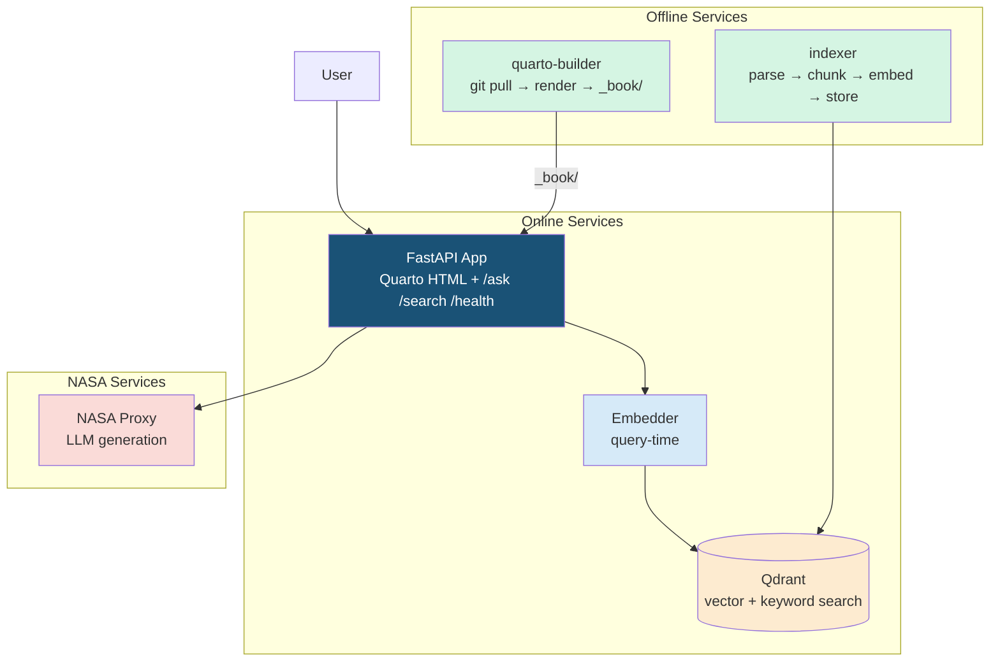
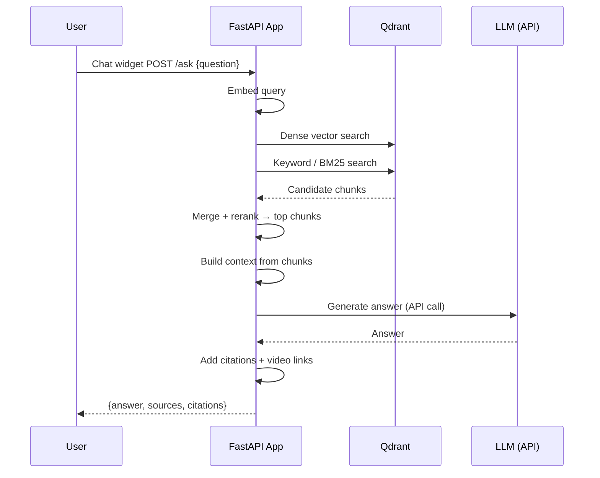
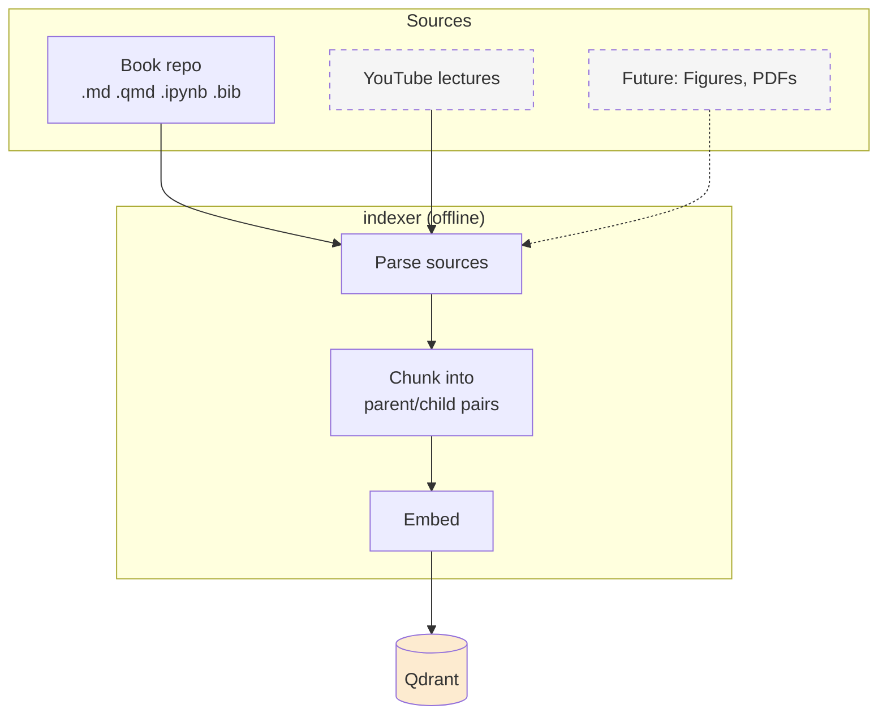
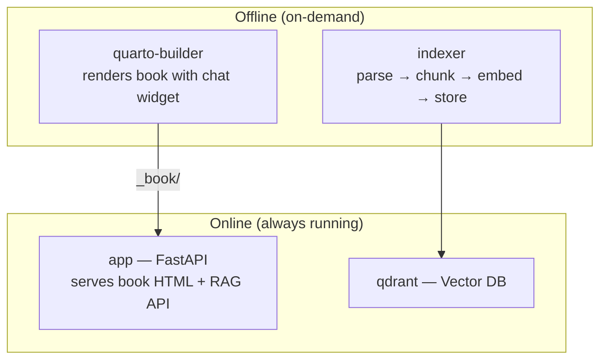
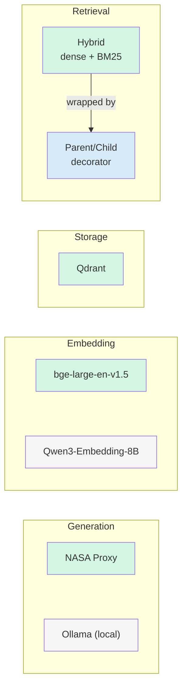
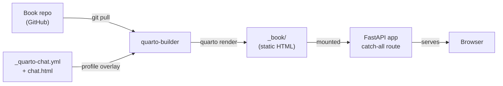

# EarthRISE Book RAG Assistant — Architecture Overview

**Book:** [nasa-earthrise.github.io/EarthRISE-Applied-Artificial-Intelligence-and-Deep-Learning-Book](https://nasa-earthrise.github.io/EarthRISE-Applied-Artificial-Intelligence-and-Deep-Learning-Book/) \
**Videos:** [YouTube Playlist](https://www.youtube.com/playlist?list=PLKlxghiZuIM5YyM92lDtsJT7p0Aln3R_k)

---

## Design Principles

| Principle | Meaning |
|---|---|
| Interface-driven | Key components sit behind interfaces. Swap adapters via env vars — zero code changes. |
| Retrieval quality first | Bad retrieval + great LLM = hallucinations. Great retrieval + decent LLM = good answers. |
| Components are independent | Embedding, storage, generation, and retrieval are separate adapters. Mix NASA infra with our own per-component. |

---

## System Overview

---

## How a Question Gets Answered

---

## How Content Gets Indexed

---

## Infrastructure

| Container | Role | Online? |
|---|---|---|
| **app** | FastAPI: serves _book/ (Quarto HTML) + RAG API. Same origin. | Yes |
| **qdrant** | Vector DB (dense + sparse search) | Yes |
| **quarto-builder** | git pull → inject chat widget → quarto render → _book/ | No — offline |
| **indexer** | parse → chunk → embed → upsert to Qdrant | No — offline |

---

## What's Swappable

Green = current default. Gray = alternatives. Swap via env vars.

---

## How the Book Gets Served

Chat widget calls `/ask` on the same origin — no CORS, no API key in browser.

---

## API Endpoints

| Endpoint | Method | Purpose |
|---|---|---|
| `/health` | GET | Service status |
| `/search` | POST | Retrieval-only — ranked chunks with metadata |
| `/ask` | POST | Full RAG — generated answer + citations |

**Planned:**
- `/feedback` — user rating on answer quality
- `/log` — analytics data forwarding

---

## Analytics & Economic Impact Assessment (EIA)

Planned GA4 custom events and Google Sheets integration for the Economic Impact Assessment.

| Event | Trigger | Purpose |
|---|---|---|
| `chat_query` | Message sent | Usage tracking |
| `chapter_complete` | Scroll > 90% | Engagement |
| `colab_click` | Notebook link clicked | Active learning signal |
| `video_deeplink_click` | Timestamp link clicked | Video engagement |
| `survey_role` | Role button tapped | User segmentation |
| `survey_usefulness` | Rating tapped | Rubric scoring |

---

## Security

- API keys server-side only (never in browser)
- Same-origin serving eliminates client-side API key exposure
- System prompt treats retrieved content as reference material, not instructions
- `LLM_API_KEY` stored as `SecretStr` — never appears in logs

---

For detailed component contracts, interfaces, and adapter specifications see [architecture_contracts.md](architecture_contracts.md).
