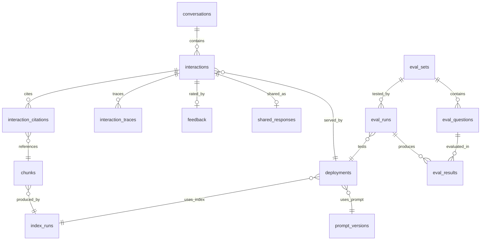

# Database Schema

PostgreSQL 17 + pgvector.
Schema managed by Alembic migrations; SQLAlchemy models are the code-level source of truth.
This document captures architectural decisions and rationale - not exact column definitions.

---

## Data Hierarchy

```
visitor (localStorage UUID, never expires)
  └── conversation (until "Clear chat" or fresh browser visit)
       └── interaction (each Q&A pair)
            ├── interaction_citations → chunks
            ├── interaction_traces
            └── feedback
```

---

## Entity Relationships



---

## Design Decisions

**No sessions table.**
Visit patterns (inactivity gaps) are derivable from interaction timestamps.
The conversation is the meaningful domain concept - a chat thread that persists until the user explicitly clears it or opens a fresh browser visit.

**Client-generated conversation IDs, server-generated interaction IDs.**
Conversations need the ID before the first request (stored in localStorage, sent with every /chat call).
Interactions need the ID after the response (server pre-allocates UUID, returns in SSE meta event so the widget can immediately wire up feedback and sharing).

**Immutable deployments.**
A deployment is a complete pipeline configuration snapshot: prompt + index + model + temperature + strategy.
Each config change creates a new deployment row; old interactions reference the old deployment.
Partial unique index enforces at most one active deployment at any time.

**No derived data stored.**
Chunk count, eval summary, conversation duration - all computed from source tables at query time.
Views provide the aggregated interfaces for the admin dashboard.
At the expected scale, these aggregations are trivial.

**Chunks normalized into own table.**
Chunk text and metadata stored once, referenced by FK from citations.
The same book passage can be cited across many interactions without text duplication.
Chunks are populated during indexing (same UUID as Qdrant) and retained across re-indexes so historical interactions can still reference what they cited.

**Traces and citations serve different access patterns.**
Traces (JSONB per pipeline stage): raw retrieval output, all candidates, intermediate scores.
For debugging - queried rarely, when the admin inspects one specific interaction.
Citations (structured table): final cited sources with scores and ranking method.
For analytics - queried frequently, powering heatmaps and gap analysis.

**query_embedding coupled to embedding model.**
The VECTOR dimension is fixed to the current model.
Model changes are rare, require full re-indexing, and include an ALTER on the column dimension.
The deployment chain (interaction -> deployment -> index_run -> config) records which model was used.

**Evaluation results are self-contained.**
Eval results store response, citations, trace, and scores inline (JSONB) rather than referencing the interaction/citation/trace tables.
Eval runs are not real user interactions and should not appear in the interactions table.
At eval scale, the inline JSONB approach is simpler without performance cost.

**Rate limiting: DB tracks counts, app owns thresholds.**
The feedback_rate_limits table counts submissions per IP per time window.
The threshold (e.g., 30/minute) is application config, not stored in the database.
Tunable without migrations.
