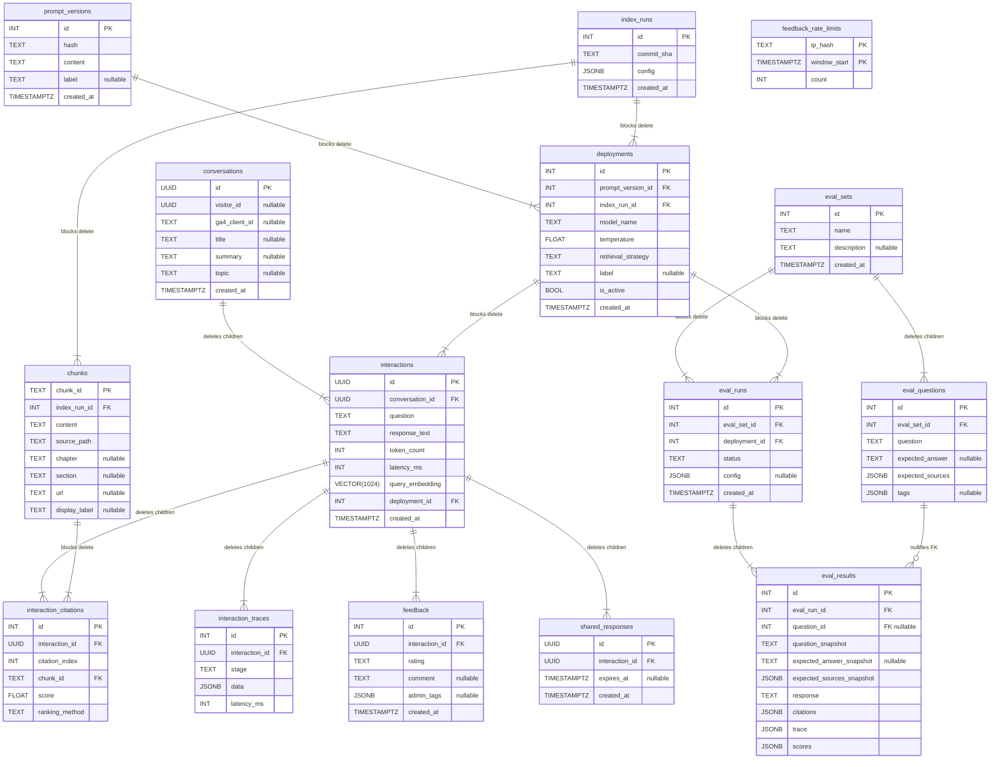

# Database Schema

PostgreSQL 17 + pgvector.
15 tables in the `earthrise` schema.
Auto-generated from SQLAlchemy ORM models.
Regenerate with `uv run python scripts/generate_schema_diagram.py`.

```mermaid
erDiagram
    %% --- User Interaction ---
    conversations {
        UUID id "PK"
        UUID visitor_id "nullable"
        TEXT ga4_client_id "nullable"
        TEXT title "nullable"
        TEXT summary "nullable"
        TEXT topic "nullable"
        TIMESTAMPTZ created_at
    }
    interactions {
        UUID id "PK"
        UUID conversation_id "FK"
        TEXT question
        TEXT response_text
        INT token_count
        INT latency_ms
        VECTOR(1024) query_embedding
        INT deployment_id "FK"
        TIMESTAMPTZ created_at
    }
    interaction_citations {
        INT id "PK"
        UUID interaction_id "FK"
        INT citation_index
        TEXT chunk_id "FK"
        FLOAT score
        TEXT ranking_method
    }
    interaction_traces {
        INT id "PK"
        UUID interaction_id "FK"
        TEXT stage
        JSONB data
        INT latency_ms
    }
    feedback {
        INT id "PK"
        UUID interaction_id "FK"
        TEXT rating
        TEXT comment "nullable"
        JSONB admin_tags "nullable"
        TIMESTAMPTZ created_at
    }
    %% --- Infrastructure ---
    prompt_versions {
        INT id "PK"
        TEXT hash
        TEXT content
        TEXT label "nullable"
        TIMESTAMPTZ created_at
    }
    index_runs {
        INT id "PK"
        TEXT commit_sha
        JSONB config
        TIMESTAMPTZ created_at
    }
    deployments {
        INT id "PK"
        INT prompt_version_id "FK"
        INT index_run_id "FK"
        TEXT model_name
        FLOAT temperature
        TEXT retrieval_strategy
        TEXT label "nullable"
        BOOL is_active
        TIMESTAMPTZ created_at
    }
    chunks {
        TEXT chunk_id "PK"
        INT index_run_id "FK"
        TEXT content
        TEXT source_path
        TEXT chapter "nullable"
        TEXT section "nullable"
        TEXT url "nullable"
        TEXT display_label "nullable"
    }
    %% --- Evaluation ---
    eval_sets {
        INT id "PK"
        TEXT name
        TEXT description "nullable"
        TIMESTAMPTZ created_at
    }
    eval_questions {
        INT id "PK"
        INT eval_set_id "FK"
        TEXT question
        TEXT expected_answer "nullable"
        JSONB expected_sources
        JSONB tags "nullable"
    }
    eval_runs {
        INT id "PK"
        INT eval_set_id "FK"
        INT deployment_id "FK"
        TEXT status
        JSONB config "nullable"
        TIMESTAMPTZ created_at
    }
    eval_results {
        INT id "PK"
        INT eval_run_id "FK"
        INT question_id "FK nullable"
        TEXT question_snapshot
        TEXT expected_answer_snapshot "nullable"
        JSONB expected_sources_snapshot
        TEXT response
        JSONB citations
        JSONB trace
        JSONB scores
    }
    %% --- Sharing and Limits ---
    shared_responses {
        UUID id "PK"
        UUID interaction_id "FK"
        TIMESTAMPTZ expires_at "nullable"
        TIMESTAMPTZ created_at
    }
    feedback_rate_limits {
        TEXT ip_hash "PK"
        TIMESTAMPTZ window_start "PK"
        INT count
    }

    %% --- Relationships ---
    conversations ||--|{ interactions : "deletes children"
    deployments ||--|{ interactions : "blocks delete"
    interactions ||--|{ interaction_citations : "deletes children"
    chunks ||--|{ interaction_citations : "blocks delete"
    interactions ||--|{ interaction_traces : "deletes children"
    interactions ||--|{ feedback : "deletes children"
    prompt_versions ||--|{ deployments : "blocks delete"
    index_runs ||--|{ deployments : "blocks delete"
    index_runs ||--|{ chunks : "blocks delete"
    eval_sets ||--|{ eval_questions : "deletes children"
    eval_sets ||--|{ eval_runs : "blocks delete"
    deployments ||--|{ eval_runs : "blocks delete"
    eval_runs ||--|{ eval_results : "deletes children"
    eval_questions ||--o{ eval_results : "nullifies FK"
    interactions ||--|{ shared_responses : "deletes children"
```
